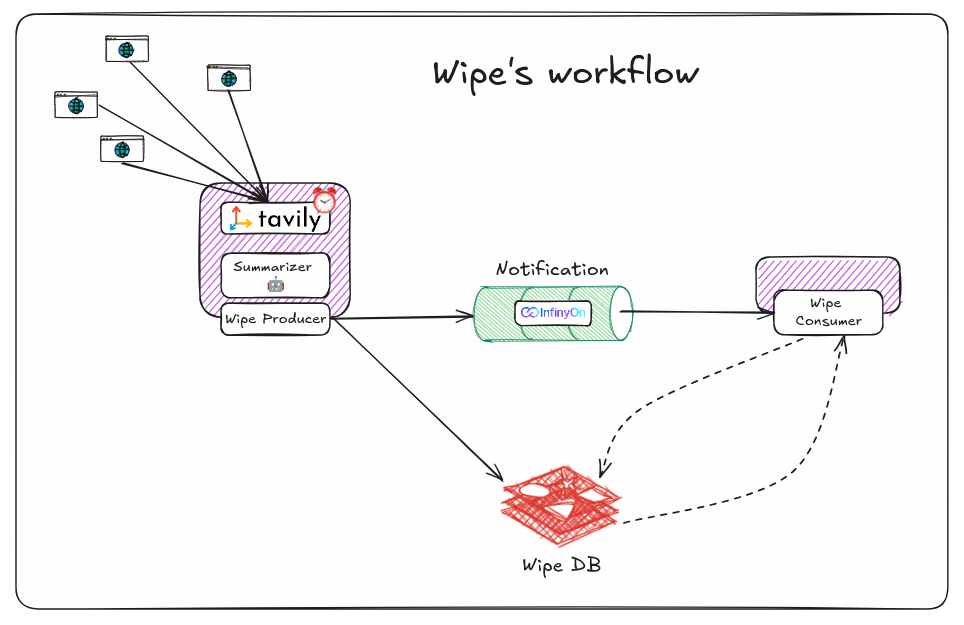

# WIPE 

> Eye wiped, AI hyped. 

## Introduction

**Tired of Falling Behind in the Fast-Paced World of AI?** We're here to **wipe** them away. Wip delivers real-time updates on the latest AI trends, ensuring you stay ahead of the curve.



**Workflow**:

+ The Publisher generates updates on the latest AI trends.
+ The Feature component processes these updates, potentially performing tasks like natural language processing, data analysis, or summarization.
+ The processed updates are sent to the Notification component, which distributes them to interested Consumers.
+ The Consumers can then utilize the trend updates for their specific purposes, such as training AI models, updating product features, or providing personalized recommendations.

## Features

- Update latest information related to AI. 
- Summarize article with Large Language Models.


## Getting Started

It is noteworthy that the app is heavily depend on using Docker. Therefore, to run the app, Docker should be on your machine.

1. Clone the repository

```
git clone https://github.com/MinLee0210/Wipe.git
cd ./Wipe
pip install -r requirements.txt
```

2. Setup environment

Create an `.env` file in the root directory following this format. 

```
TAVILY_API_KEY = ""
GEMINI_API_KEY=""  
GROQ_API_KEY=""
OPENAI_API_KEY="
```

Additionally, you have to setup the Redis database. 

_Note:_ `TAVILY_API_KEY` is a must for the API of search engine. Choice of LLM's API depends on your usage. You can switch between Gemini, Groq, and OpenAI. 


3. Usage

**Build and start Docker Image**
```
cd ./fluvio
docker-compose up --build
```

**Running the app**

You can easily run the `run.sh` file that I have already scripted. Otherwise, you can type: 

```
python producer.py &
python consumer.py
```

## Galleries

+ Document: [substack.com](https://open.substack.com/pub/minhleduc/p/how-to-build-an-autonomous-news-generator?r=344eb1&utm_campaign=post&utm_medium=web&showWelcomeOnShare=true)
+ Youtube: [link]()

### Producer

The Producer automatically gets the latest trends from the Internet and uses AI to summarize the website every 10 seconds. After the summarization is done, it makes an event to notify its customers.


### Customer

The Customer retrieves a notification from its producer. In this experiment, I set it to randomly choose whether to "read" the news from the notification or not.


## Contact me via

+ **GitHub:** https://github.com/MinLee0210
+ **Gmail:** minh.leduc.0210@gmail.com
+ **LinkedIn:** www.linkedin.com/in/minhle007


## Note

_User story:_ 

+ As a user, I want to be updated daily with latest AI trends.
+ As a user, I want to capture all information in the news in a matter of second. 
